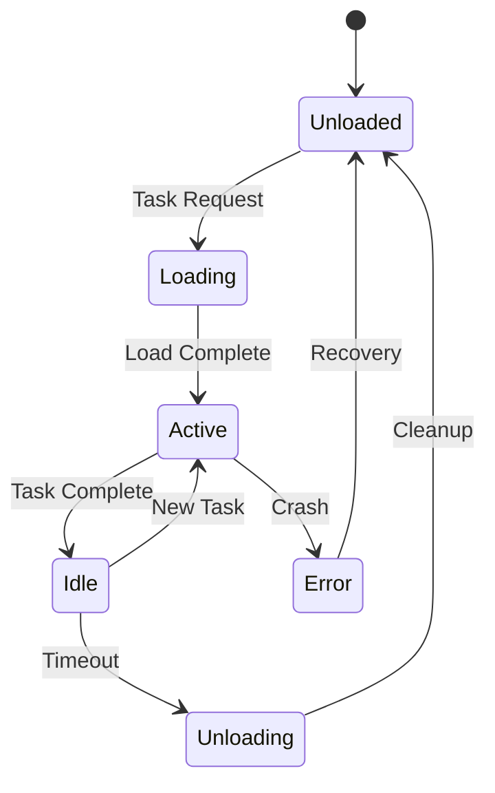

# Claude Flow Resource Management Plan

## Problem Statement

Claude Flow supports 64 specialized agents, but running all simultaneously would consume excessive resources on an Ubuntu server. We need a resource management strategy that maintains functionality while ensuring stability.

## Current Resource Usage Estimates

### Per Agent (Approximate)
- **Memory**: 50-100MB per agent
- **CPU**: Variable (0.1-2% when idle, 5-20% when active)
- **File Handles**: 10-20 per agent
- **Network Connections**: 1-3 per agent

### Full System (64 Agents)
- **Memory**: 3.2GB - 6.4GB (unacceptable for most servers)
- **CPU**: Could spike to 100%+ during concurrent operations
- **File Handles**: 640-1280 (may hit system limits)
- **Process Count**: 64+ (affects scheduling)

## Proposed Solution: Agent Pool Architecture

### Core Concepts

1. **Agent Pooling**: Instead of 64 always-running agents, maintain a pool of 8-12 active agents
2. **Dynamic Loading**: Load agent configurations on-demand
3. **Task Queuing**: Queue tasks for busy agents
4. **Smart Scheduling**: Prioritize based on task type and urgency

### Architecture Design

```
┌─────────────────────────────────────────────────┐
│              Claude Flow Manager                 │
├─────────────────────────────────────────────────┤
│                                                  │
│  ┌─────────────┐        ┌──────────────────┐   │
│  │ Agent Pool  │        │  Agent Registry  │   │
│  │  (8-12)     │◄──────►│   (64 configs)   │   │
│  └──────┬──────┘        └──────────────────┘   │
│         │                                        │
│         ▼                                        │
│  ┌─────────────┐        ┌──────────────────┐   │
│  │ Task Queue  │        │ Resource Monitor │   │
│  │             │◄──────►│                  │   │
│  └─────────────┘        └──────────────────┘   │
│                                                  │
└─────────────────────────────────────────────────┘
```

## Implementation Details

### 1. Agent Pool Manager
```typescript
interface AgentPoolConfig {
  minAgents: number;      // Minimum agents to keep alive (4)
  maxAgents: number;      // Maximum concurrent agents (12)
  idleTimeout: number;    // Time before idle agent unloads (300s)
  memoryLimit: number;    // Max memory per agent (100MB)
  totalMemoryLimit: number; // Total memory for all agents (800MB)
}

class AgentPoolManager {
  private activeAgents: Map<string, Agent>;
  private agentQueue: TaskQueue;
  private resourceMonitor: ResourceMonitor;
  
  async requestAgent(type: string): Promise<Agent> {
    // Check if agent type is already loaded
    // If not, check resource availability
    // Load agent or queue request
  }
  
  async releaseAgent(agentId: string): Promise<void> {
    // Mark agent as available
    // Start idle timer
    // Process queued requests
  }
}
```

### 2. Resource Monitor
```typescript
interface ResourceMetrics {
  totalMemoryMB: number;
  availableMemoryMB: number;
  cpuUsagePercent: number;
  activeAgentCount: number;
  queuedTaskCount: number;
}

class ResourceMonitor {
  async checkResources(): Promise<boolean> {
    // Monitor system resources
    // Return true if safe to spawn new agent
  }
  
  async enforceL

(): Promise<void> {
    // Kill agents if over memory limit
    // Throttle CPU-intensive operations
  }
}
```

### 3. Agent Lifecycle



### 4. Task Priority System

```typescript
enum TaskPriority {
  CRITICAL = 0,    // System tasks, error handling
  HIGH = 1,        // User-initiated tasks
  NORMAL = 2,      // Regular operations
  LOW = 3,         // Background tasks
  IDLE = 4         // Maintenance, cleanup
}

interface Task {
  id: string;
  agentType: string;
  priority: TaskPriority;
  payload: any;
  timeout: number;
  retries: number;
}
```

## Configuration Options

### Default Configuration (Recommended)
```json
{
  "agentPool": {
    "minAgents": 4,
    "maxAgents": 8,
    "idleTimeout": 300,
    "memoryLimitMB": 100,
    "totalMemoryLimitMB": 800
  },
  "taskQueue": {
    "maxQueueSize": 100,
    "taskTimeout": 300,
    "retryLimit": 3
  },
  "resourceLimits": {
    "maxCpuPercent": 70,
    "maxMemoryPercent": 50,
    "checkInterval": 5000
  }
}
```

### Profiles

#### 1. Minimal (1GB RAM Server)
```json
{
  "minAgents": 2,
  "maxAgents": 4,
  "totalMemoryLimitMB": 400
}
```

#### 2. Standard (4GB RAM Server)
```json
{
  "minAgents": 4,
  "maxAgents": 8,
  "totalMemoryLimitMB": 800
}
```

#### 3. Performance (8GB+ RAM Server)
```json
{
  "minAgents": 8,
  "maxAgents": 16,
  "totalMemoryLimitMB": 2000
}
```

## Agent Categories and Pooling Strategy

### Always-Loaded Agents (Core Pool)
1. **Orchestrator** - Main coordinator
2. **Router** - Request routing
3. **Monitor** - System health
4. **Logger** - Event logging

### On-Demand Agents (Dynamic Pool)
- **Development Agents**: Code writers, reviewers
- **Testing Agents**: Test runners, validators
- **Documentation Agents**: Doc writers, analyzers
- **Utility Agents**: File handlers, searchers

### Rarely-Used Agents (Load on Request)
- **Specialized Agents**: Language-specific, framework-specific
- **Integration Agents**: Third-party integrations
- **Experimental Agents**: Beta features

## Implementation Phases

### Phase 1: Core Infrastructure (Week 1)
1. Implement AgentPoolManager
2. Create ResourceMonitor
3. Build TaskQueue system
4. Add basic lifecycle management

### Phase 2: Agent Integration (Week 2)
1. Modify agent loading mechanism
2. Add agent state persistence
3. Implement graceful shutdown
4. Create agent registry

### Phase 3: Optimization (Week 3)
1. Add intelligent pre-loading
2. Implement agent caching
3. Optimize memory usage
4. Add performance metrics

### Phase 4: Production Hardening (Week 4)
1. Add comprehensive error handling
2. Implement circuit breakers
3. Add monitoring dashboards
4. Create operational runbooks

## Monitoring and Metrics

### Key Metrics to Track
```typescript
interface PoolMetrics {
  // Resource metrics
  totalMemoryUsage: number;
  perAgentMemoryUsage: Map<string, number>;
  cpuUsageHistory: number[];
  
  // Performance metrics
  taskQueueLength: number;
  averageTaskWaitTime: number;
  agentUtilization: Map<string, number>;
  
  // Health metrics
  agentCrashCount: number;
  taskFailureRate: number;
  resourceLimitBreaches: number;
}
```

### Alerting Thresholds
- Memory usage > 80% of limit
- CPU usage > 90% for 30 seconds
- Task queue > 50 items
- Agent crash rate > 5 per hour
- Task failure rate > 10%

## Graceful Degradation

### Under Resource Pressure
1. **Level 1**: Increase task timeouts
2. **Level 2**: Reduce max agents
3. **Level 3**: Pause non-critical tasks
4. **Level 4**: Emergency mode (core agents only)

### Recovery Strategy
1. Monitor resource availability
2. Gradually increase capacity
3. Process queued tasks by priority
4. Return to normal operations

## Testing Strategy

### Unit Tests
- Agent lifecycle management
- Resource monitoring accuracy
- Task queuing logic
- Priority scheduling

### Integration Tests
- Multi-agent coordination
- Resource limit enforcement
- Graceful degradation
- Recovery procedures

### Load Tests
- Spawn maximum agents
- Queue 1000+ tasks
- Simulate memory pressure
- Test crash recovery

### Chaos Tests
- Random agent kills
- Resource exhaustion
- Network failures
- Concurrent load spikes

## Success Metrics

1. **Stability**: Zero OOM kills in 7 days
2. **Performance**: 95% of tasks complete within SLA
3. **Efficiency**: Average agent utilization > 60%
4. **Scalability**: Handle 100 tasks/minute
5. **Reliability**: 99.9% uptime for core agents

## Migration Path

### From Current (All Agents) to Pooled Architecture

1. **Week 1**: Implement pool manager alongside existing system
2. **Week 2**: Migrate 10 agents to pool
3. **Week 3**: Migrate 30 more agents
4. **Week 4**: Complete migration, remove old system

This resource management plan ensures Claude Flow can run efficiently on Ubuntu servers while maintaining the power of 64 specialized agents through intelligent pooling and scheduling.